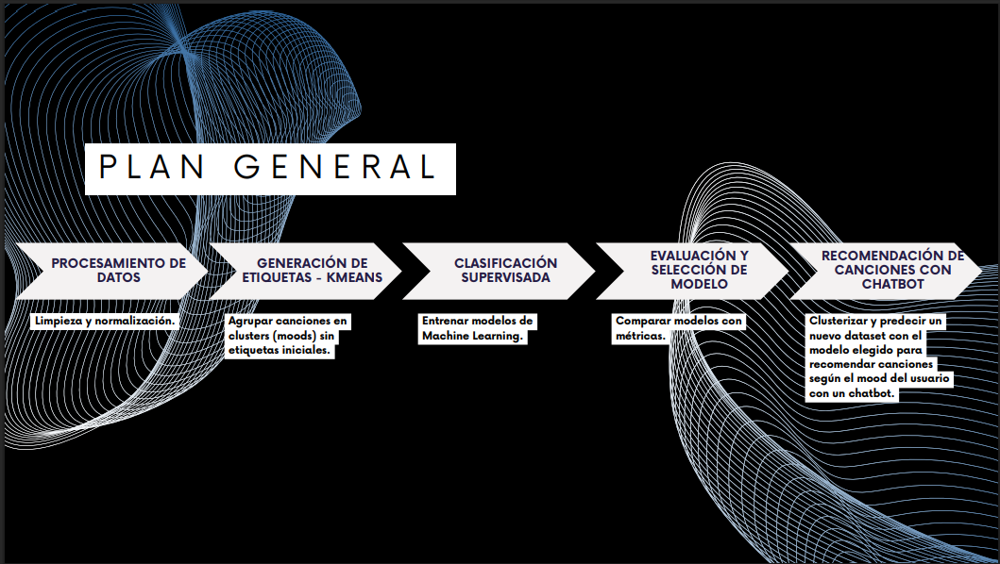
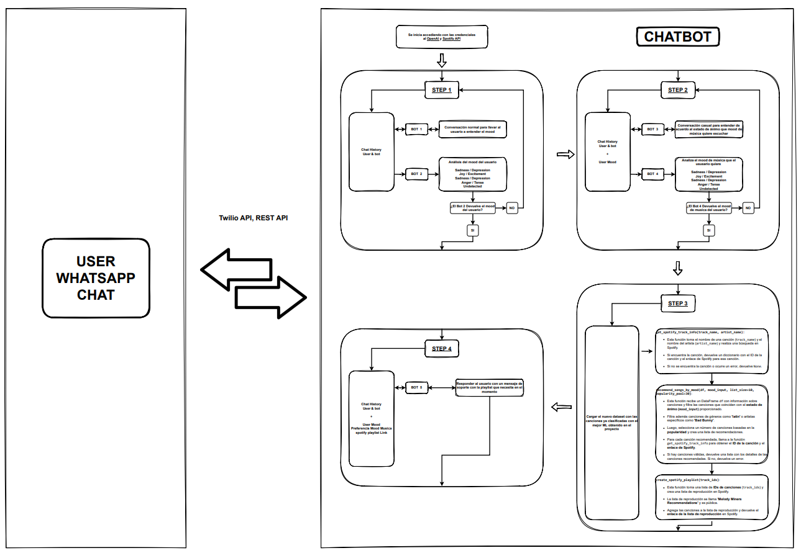
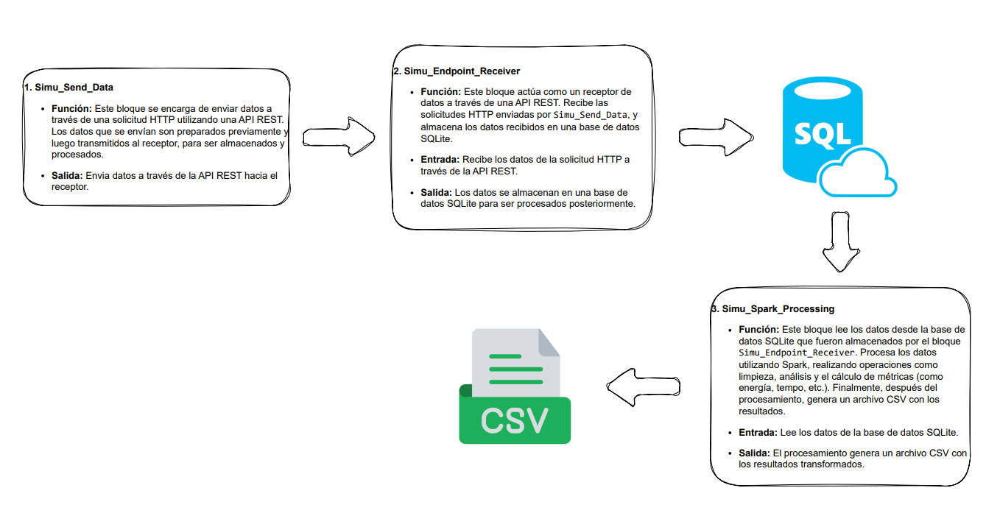

# ProyectoFinal BigData MachineLearning 14 - Melody Miners

---

## Datasets del proyecto

---

## Estructura del Repositorio

Este repositorio contiene diversos archivos y carpetas organizados para el desarrollo del proyecto. A continuación se describe la estructura del repositorio:

### Carpetas

- **RawData**: Contiene los datos originales o crudos, antes de cualquier procesamiento.
- **ProcessedData**: Contiene los datos procesados o generados a partir de los modelos de Machine Learning, como los datos limpios, transformados o enriquecidos.
- **Images**: Almacena imágenes utilizadas en el proyecto o para la documentación.
- **InfoProyecto**: Contiene archivos relacionados con la información del proyecto, como documentos y presentaciones.
- **ModelsOutput**: Carpeta destinada a los resultados generados por los modelos de Machine Learning, como predicciones, métricas, o cualquier otro output del modelo.
- **Code**: Archivos principales de programación que definen la lógica central del proyecto.
- **Videos**: Archivos de video relacionados con el proyecto.
- **PowerBI**: Archivos asociados a los análisis y dashboards en Power BI.
- **Diagramas**: Contiene los diagramas de arquitectura del código creados con **Draw.io** para ilustrar la estructura y el flujo del proyecto.

### Archivos

- **.gitignore**: Archivo que especifica qué archivos o carpetas deben ser ignorados por Git.
- **Info.md**: Documento que contiene información general sobre el proyecto.
- **Presentacion_Final_Melody_Miners.pdf**: Presentación final del proyecto.
- **Proyecto_Final_Melody_Miners.ipynb**: Notebook de Jupyter con el proyecto final.
- **README.md**: Este archivo con la descripción y estructura del repositorio.
- **code_chatbot.ipynb**: Notebook de Jupyter relacionado con el desarrollo del chatbot.
- **code_proyecto.ipynb**: Notebook con el código principal del proyecto.
- **code_simulacion_sql_spark.ipynb**: Notebook relacionado con la simulación utilizando SQL y Spark.
- **code_simu_StorageIngestMetrics.ipynb**: Notebook relacionado con la simulación del Almacenamiento, Ingesta y Métricas, utilizando REST, SQLite y PySpark.

## Datasets del Proyecto

Los datasets utilizados en este proyecto se pueden obtener desde los siguientes enlaces:

1. [Spotify Dataset (1921-2020, 600k tracks)](https://www.kaggle.com/datasets/yamaerenay/spotify-dataset-19212020-600k-tracks/)
2. [Spotify Tracks Dataset](https://www.kaggle.com/datasets/maharshipandya/-spotify-tracks-dataset/)

### Descripción Adicional

Cada carpeta y archivo está organizado para facilitar la navegación y la colaboración dentro del proyecto. La carpeta **Code** y los notebooks contienen el código fuente, mientras que las carpetas de datos, imágenes, y videos permiten la inclusión de recursos y materiales de apoyo. Los archivos de Power BI están organizados por análisis específicos que se realizan sobre los datos.

Si tienes alguna pregunta sobre cómo usar el repositorio o necesitas más detalles sobre algún archivo, no dudes en contactar al stuff de Melody  **Miners**.

---

## Plan General - Proyecto Final

---

## Chatbot Arquitectura 

---

## Simulacion Arquitectura del Flujo de Datos: Envío, Almacenamiento y Procesamiento

---
